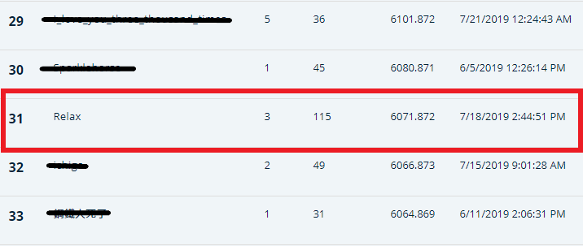

# T-Brain玉山人工智慧公開挑戰賽2019夏季賽

台灣不動產AI神預測

參考連結: <https://tbrain.trendmicro.com.tw/Competitions/Details/6>

## Team: Relax

* **yolearn** ([github](https://github.com/yolearn))
* **phacus** ([github](https://github.com/phacus))

## Built With

* Python 3.7
* Jupyter
* LightGBM
* scikit-learn

## Results

*Final private leaderboard:* ***31/766***

分數計算 ( hit-rate score ) 可參考 [比賽網站](https://tbrain.trendmicro.com.tw/Competitions/Details/6)

## Documentation

請參考doc資料夾 ( 閃電講ppt , 攤位海報 )
